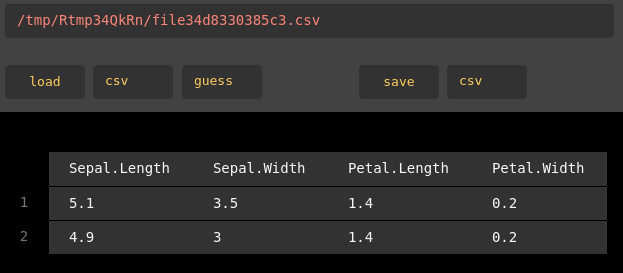

<!-- README.md is generated from README.Rmd. Please edit that file -->
shed
====

[](https://www.tidyverse.org/lifecycle/#experimental)



A minimal, eye-friendly csv editor made with shiny, rhandsontable and readr. Shed is designed to quickly edit small (hundreds of rows) csv files and `data.frames`. It uses `readr::write_excel_csv()` as backend for writing files, and thus produces UTF-8 encoded csv files that are compatbile with MS Excel by default.

Development status
------------------

**shed is currently beeing rewritten. A finished CRAN ready version is planned for mid 2019 as I wanna finish some other projects first**

shed is perfectly usable and the internals are more or less stable. The user interface might still change a bit, especially how files are read and written. There is also an [issue in rhandsontable](https://github.com/jrowen/rhandsontable/issues/264) which I want to see fixed - or figure out a workaround for - before I plan on putting shed on CRAN.

If you have any feature requests or comments don't hesitate to file an issue or send a mail.

Installation
------------

You can install shed from github with:

``` r
# install.packages("devtools")
devtools::install_github("s-fleck/shed")
```

Example
-------

``` r
shed(iris)

# Uppon termination, shed returns the edited data.frame

x <- shed(iris)
```
